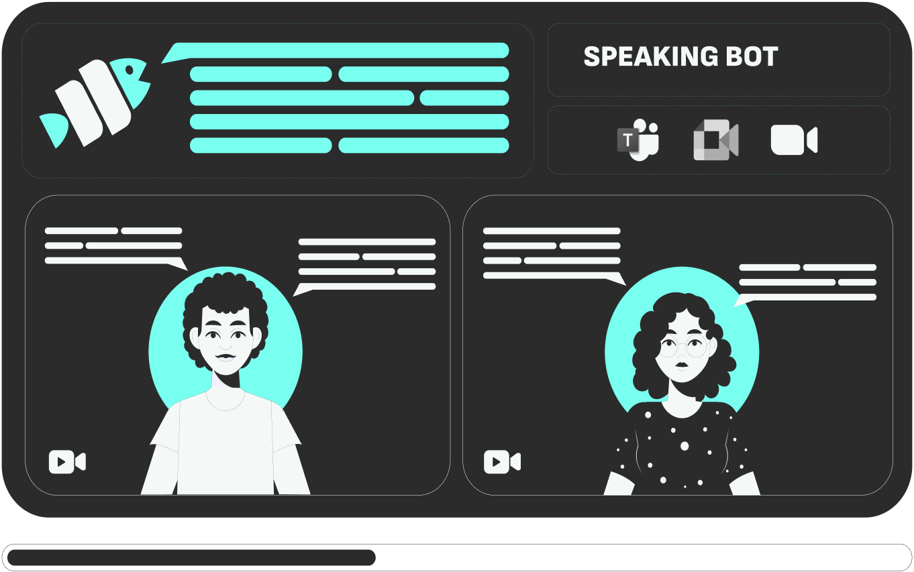

# Speaking Bot

<p align="center">
  
</p>

This repository expands upon [Pipecat](https://github.com/pipecat-ai/pipecat)'s Python framework for building voice and multimodal conversational agents. Our implementation creates AI meeting agents that can join and participate in Google Meet and Microsoft Teams meetings with distinct personalities and capabilities defined in Markdown files.

## Overview

This project extends [Pipecat's WebSocket server implementation](https://github.com/pipecat-ai/pipecat/tree/main/examples/websocket-server) to create:

-   Meeting agents that can join Google Meet or Microsoft Teams through the [MeetingBaas API](https://meetingbaas.com)
-   Customizable personas with unique context
-   Support for running multiple instances locally or at scale

## Architecture

### Core Framework: Pipecat Integration

[Pipecat](https://github.com/pipecat-ai/pipecat) provides the foundational framework with:

-   Real-time audio processing pipeline
-   WebSocket communication
-   Voice activity detection
-   Message context management

In this implementation, Pipecat is integrated with [Cartesia](https://www.cartesia.ai/) for speech generation (text-to-speech), [Gladia](https://www.gladia.io/) or [Deepgram](https://deepgram.com/) for speech-to-text conversion, and [OpenAI](https://platform.openai.com/)'s GPT-4 as the underlying LLM.

### Project Extensions

Building upon Pipecat, we've added:

-   Persona system with Markdown-based configuration for:
    -   Core personality traits and behaviors
    -   Knowledge base and domain expertise
    -   Additional contextual information (websites formatted to MD, technical documentation, etc.)
-   CLI-based creation tool
-   AI image generation via [Replicate](https://replicate.com/docs)
-   Image hosting through [UploadThing](https://uploadthing.com/) (UTFS)
-   [MeetingBaas](https://meetingbaas.com) integration for video meeting platform support
-   Multi-agent orchestration

## Required API Keys

### For Pipecat-related Services

-   [OpenAI](https://platform.openai.com/) (LLM)
-   [Cartesia](https://www.cartesia.ai/) (text-to-speech)
-   [Gladia](https://www.gladia.io/) or [Deepgram](https://deepgram.com/) (speech-to-text)
-   [MeetingBaas](https://meetingbaas.com) (video meeting platform integration)

### For Project-specific Add-ons

-   [OpenAI](https://platform.openai.com/) (LLM to complete the user prompt and match to a Cartesia Voice ID)
-   [Replicate](https://replicate.com/docs) (AI image generation)
-   [UploadThing](https://uploadthing.com/) (UTFS) (image hosting)

For speech-related services (TTS/STT) and LLM choice (like Claude, GPT-4, etc), you can freely choose and swap between any of the integrations available in [Pipecat's supported services](https://docs.pipecat.ai/api-reference/services/supported-services).

### Important Note

[OpenAI](https://platform.openai.com/)'s GPT-4, [UploadThing](https://uploadthing.com/) (UTFS), and [Replicate](https://replicate.com/docs) are currently hard-coded specifically for the CLI-based persona generation features: matching personas to available voices from Cartesia, generating AI avatars, and creating initial personality descriptions and knowledge bases.
You do not need a Replicat or UTFS API key to run the project if you're not using the CLI-based persona creation feature and edit Markdowns manually.

## Persona System

### Bot Service

-   Real-time audio processing pipeline
-   WebSocket-based communication
-   Tool integration (weather, time)
-   Voice activity detection
-   Message context management

-   Dynamic persona loading from markdown files
-   Customizable personality traits and behaviors
-   Support for multiple languages
-   Voice characteristic customization
-   Image generation for persona avatars
-   Metadata management for each persona

### Persona Structure

Each persona is defined in the `@personas` directory with:

-   A README.md defining their personality
-   Space for additional markdown files to expand knowledge and behaviour

### Example Persona Structure

```
@personas/
└── quantum_physicist/
    ├── README.md
    └── (additional beVhavior files)
```

## Prerequisites

-   Python 3.x
-   `grpc_tools` for protocol buffer compilation
-   Ngrok (for local deployment)
-   Poetry for dependency management

## Installation

### 1. Set Up Poetry Environment

```bash
# Install Poetry (Unix/macOS)
curl -sSL https://install.python-poetry.org | python3 -

# Install Poetry (Windows)
(Invoke-WebRequest -Uri https://install.python-poetry.org -UseBasicParsing).Content | py -

# Install dependencies
poetry install

# Activate virtual environment
poetry shell
```

### 2. Compile Protocol Buffers

```bash
poetry run python -m grpc_tools.protoc --proto_path=./protobufs --python_out=./protobufs frames.proto
```

### 3. Configure Environment

```bash
cp env.example .env
```

Edit `.env` with your MeetingBaas credentials.

## Running Meeting Agents

### Single Agent Deployment

To launch one agent into a meeting:

```bash
poetry run python scripts/batch.py -c 1 --meeting-url <your-meeting-url>
```

### Multiple Agent Deployment

To launch two agents simultaneously:

```bash
poetry run python scripts/batch.py -c 2 --meeting-url <your-meeting-url>
```

### Local Deployment with Ngrok

For 1-2 agents, use Ngrok to expose your local server:

```bash
ngrok start --all --config ~/.config/ngrok/ngrok.yml,./config/ngrok/config.yml
```

### Web Deployment

For more than 2 agents, deploy to a web server to avoid Ngrok limitations.

## Future Extensibility

The persona architecture is designed to support:

-   Scrapping the websites given by the user to MD for the bot knowledge base
-   Containerizing this nicely

## Troubleshooting

-   Verify Poetry environment is activated
-   Check Ngrok connection status
-   Validate environment variables
-   Ensure unique Ngrok URLs for multiple agents

For more detailed information about specific personas or deployment options, check the respective documentation in the `@personas` directory.

## Troubleshooting WebSocket Connections

### Handling Timing Issues with ngrok and Meeting Baas Bots

Sometimes, due to WebSocket connection delays through ngrok, the Meeting Baas bots may join the meeting before your local bot connects. If this happens:

-   Simply press `Enter` to respawn your bot
-   This will reinitiate the connection and allow your bot to join the meeting

This is a normal occurrence and can be easily resolved with a quick bot respawn.
